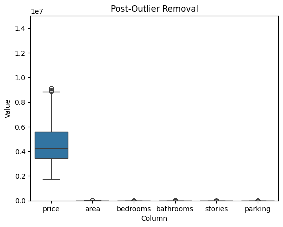
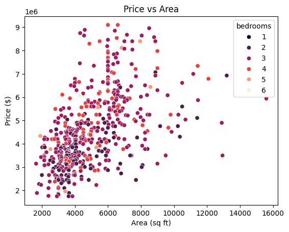
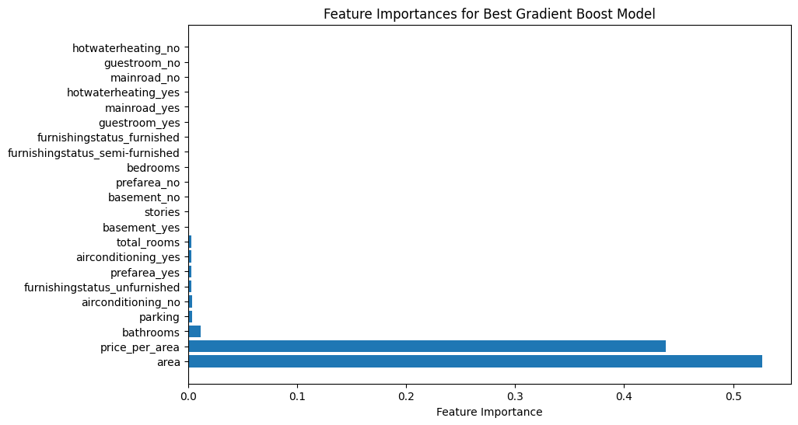
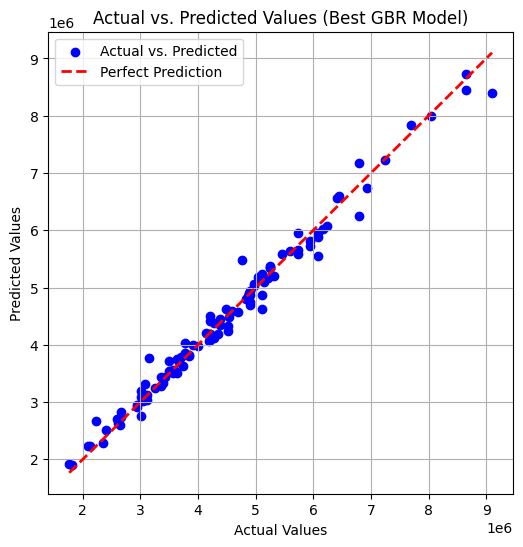

# A Predictive Model for Estimating Home Prices Based on Square Footage

*The cost of home ownership has been driven up significantly in recent years by factors like rising interest rates and limited inventory. Prices have surged 47.1% since the start of 2020, outpacing any gains seen in recent decades (Fox Business). For this project, I will create a predictive home price model using a datatset provided by kaggle, that takes the features of each property into account, to accurately predict the cost.*

## 1. Data
The sourced dataset provided by Kaggle offers many different insights on home value. This dataset gives us the price and size in area, as well as information pertaining to the features within each house. These features include things like number of bedrooms and bathrooms, number of stories the house has, and amenities such as a finished basement, hot water heating, and central air conditioning.

* [Link to Kaggle dataset](https://www.kaggle.com/datasets/yasserh/housing-prices-dataset/code)

## 2. Method
I will begin this project by cleaning up the data through the data wrangling process, exploring the dataset, and then applying different machine learning models that can help buyers or sellers determine what a fair price may be.

### **Algorithms applied to the dataset:**

Linear Regressor [*(Documentation)*](https://scikit-learn.org/stable/modules/generated/sklearn.linear_model.LinearRegression.html)

Ridge Regressor [*(Documentation)*](https://scikit-learn.org/stable/modules/generated/sklearn.linear_model.Ridge.html)

Decision Tree Regressor [*(Documentation)*](https://scikit-learn.org/stable/modules/generated/sklearn.tree.DecisionTreeRegressor.html)

Random Forest Regressor [*(Documentation)*](https://scikit-learn.org/1.6/modules/generated/sklearn.ensemble.RandomForestRegressor.html)

Gradient Boosting Regressor [*(Documentation)*](https://scikit-learn.org/stable/modules/generated/sklearn.ensemble.GradientBoostingRegressor.html)

After assessing model performance using statistical metrics such as the root mean squared error (RMSE) and mean average percent error (MAPE), it was determined that the Gradient Boosting Regressor was the algorithm to apply to this dataset that predicts home prices the best. In the future if we were to update or expand this dataset, individual model performance would be reasessed.

## 3. Data Wrangling

Upon initial inspection, **the dataset contained no missing values or duplicate columns.**

From here, outlier samples were identified in the dataset that fell outside of the interquartile range. **There were 15 outliers in the Price feature that were removed from the data** to prevent disproportionate influence on our price modeling.

## 4. Exploratory Data Analysis

After exploring the features in the dataset,the following conclusions were made:

* 3 bedrooms with 1 bathroom is most common for homes in the dataset.
* 1-2 stories is common, with some homes having up to 4.
* The price of a home is correlated most with the area (in sq ft), number of bathrooms, air conditioning, and number of stories the house contains.
* On average, you can expect to pay approximately $993 per square foot of property.

 

*To see the complete EDA,* [*click here*](https://github.com/AndrewFxrtin/SB_DS_Bootcamp/blob/main/Capstone%20Two/Capstone_Two-Modelling.ipynb)

## 5. Pre-Processing

* **Feature engineering** was performed on the data, creating new features such as the price per sq foot area, and total number of rooms per home. These features were engineered to capture underlying patterns within the data, and maximize the model's ability to make predictions

* **Categorical features** like whether the house was *fully* or *semi-furnished*, or if the property had hot water heating, **were converted into dummy variables using one-hot encoding**, where each category in the column is transformed into its own seperate binary column.

* To ensure that all features contributed equally to the model, I applied a **Min-Max Scaler** to the dataset. Features like the area and price per area had significantly larger values compared to the remaining features. Without scaling, this large disparity in values could have disproportionately influenced the model. The scaler transformed all features between 0 and 1 to treat all features on an equal footing, improving its performance during training.

* The final step before modeling was to shuffle and divide the data into **testing and training splits**, with 80% of the data being used for training, and 20% used for testing the model.

## 6. Modeling

As mentioned previously, 5 different regressor models offered through the SciKit-Learn package were applied to the dataset. After asessing model performance "Out of the box", The **Gradient Boosting Regressor (GBR)** was determined to be the best predictor for our data.

**"Out-of-the-Box" Gradient Boosting metrics on testing data:**

* *R2 :* 0.98
* *MAPE :* 3.67
* *RMSE :* 203711.61

Next, I initiated a **grid search to tune different hyperparameters** for the GBR model to improve on our predictive accuracy. This included things such as the number of total estimators and learning rate. This resulted in a signficant improvement in our predictive model, based on our evaluation metrics.

**"Hypertuned" Gradient Boosting model metrics on testing data:**

* *R2 :* 0.98
* *MAPE :* 0.03
* *RMSE :* 196233.59

Now that our model was optimized, it was time to assess the feature importances to help determine what features had the greatest impact on the models predictive success. features were extracted from our best GBR model, where we found that the predictions relied heavily on the `area` and `price per area` features.

## 7. Predictions

Predictions were made using our best GBR model and compared to the actual values in our test data. The plot below shows predicted values (blue) against the actual values (red).

## 8. Future Considerations

* With the dataset containing only 545 rows and a limited number of features, a larger dataset may be able to improve our predictions.

* After discovering that only 2 of our features had a majority of the importance in our best gbr model predictions, it may be worth removing the other features to increase execution time and model accuracy.

